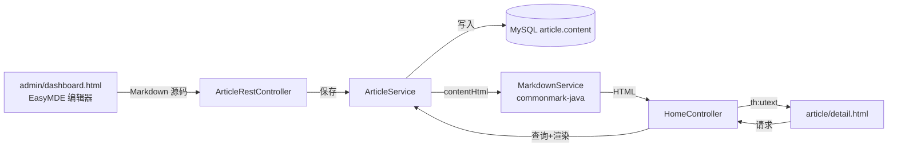

## 用户需求

完善个人博客后台管理中的文章 CRUD 功能，核心诉求为：

- 在后台编辑文章时使用 **Markdown 源格式**进行撰写与修改。
- 文章发布（status=1）后，前端详情页能够**自动将 Markdown 渲染为 HTML**并适配现有样式展示。

## 产品概述

在现有 Spring Boot + Thymeleaf 博客基础上，将文章的内容编辑与展示方式升级为 Markdown 工作流：后台编辑器输入 Markdown 源码存入数据库，前端访问时由后端实时渲染为安全的 HTML 输出。

## 核心功能

- 后台文章弹窗使用 Markdown 编辑器（带实时预览）替代普通 textarea。
- 数据库 `content` 字段存储 Markdown 源码，保留现有 CRUD 接口。
- 前端详情页展示渲染后的 HTML，自动适配标题、列表、代码块、引用等样式。
- 文章首次发布或从草稿变为发布时自动设置 `published_time`。
- 渲染过程默认对原始 HTML 标签进行转义，防止 XSS。

## 技术栈

- **后端**：Spring Boot 3.5.15 + Thymeleaf + MyBatis + commonmark-java（Markdown 渲染）
- **前端**：EasyMDE（CDN 引入）作为 Markdown 编辑器
- **数据库**：MySQL（复用现有 `article.content` 字段，无需改表）
- **构建工具**：Maven

## 实现方案

1. 在 `pom.xml` 引入 `commonmark-java` 依赖，新增 `MarkdownService`（或 `MarkdownUtil`）提供安全的 `renderToHtml(String markdown)` 方法。
2. `Article` 实体新增 transient 字段 `contentHtml`，用于承载渲染后的 HTML，避免污染持久化字段。
3. `ArticleService` 增加 `getRenderedArticleById(Long id)` 方法：查询文章后调用 MarkdownService 填充 `contentHtml`；同时完善 `updateArticle` 中发布状态变更时自动写入 `publishedTime` 的逻辑。
4. `HomeController.articleDetail` 改为调用带渲染的方法，将 `article.contentHtml` 传入模板。
5. `AdminController` / `ArticleRestController` 保持现有 REST CRUD，仅确保接口接收/返回 Markdown 源码。
6. 后台 `admin/dashboard.html` 将内容 `<textarea>` 替换为 EasyMDE 编辑区域；`admin.js` 负责初始化编辑器、回显 Markdown 源码、提交前读取编辑器值。
7. `article/detail.html` 继续使用 `th:utext` 输出 `contentHtml`。
8. `blog.css` 补充 `.article-detail-body` 下渲染后 HTML 元素（h1-h3、p、ul/ol、blockquote、pre/code、table 等）的样式，确保与现有暗色主题一致。

## 架构设计

- Markdown 渲染统一放在服务端，避免前端解析不一致及 SEO 问题。
- 数据库只存 Markdown 源码，HTML 在请求详情页时按需生成。
- 渲染工具类无状态，可在 Service 层复用。

## 设计思路

仅针对后台编辑弹窗与文章详情展示做局部改造，保持现有暗色星空主题不变。

### 后台 Markdown 编辑器

- 在原有模态框中，将内容 `<textarea>` 替换为 EasyMDE 挂载区域。
- 采用分屏（side-by-side）或预览模式，左侧编辑、右侧实时预览，降低 Markdown 上手成本。
- 编辑器宽度撑满弹窗，高度约 320px，与现有表单字段保持一致的圆角、边框和聚焦发光效果。
- 工具栏保留加粗、斜体、标题、列表、代码块、链接、图片、预览等常用按钮。

### 文章详情展示

- 继续使用现有 `.article-detail-body` 卡片容器。
- 渲染后的 HTML 元素（段落、标题、列表、代码块、引用、表格、图片）在暗色背景下保持清晰可读。
- 代码块使用半透明靛蓝背景与等宽字体，与现有 `code` 样式保持统一。
- 图片最大宽度 100%，避免撑破布局。